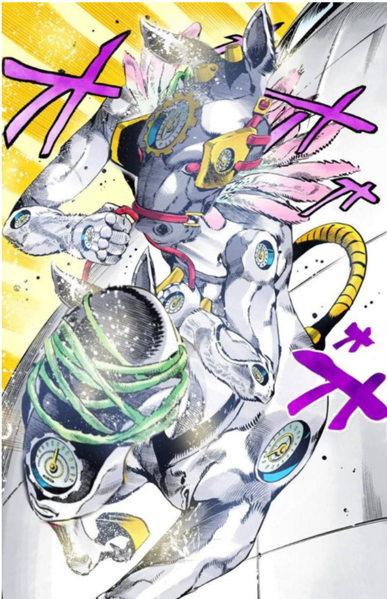
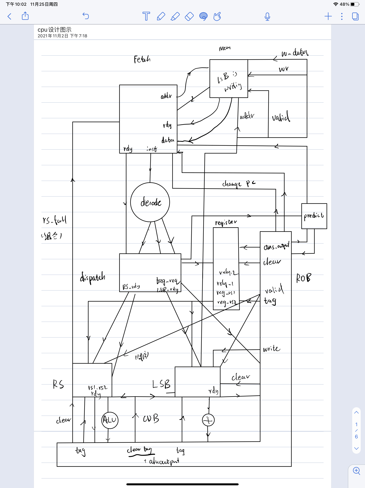

# Made-In-Heaven

_实际上是 white snake（速度：D）_ 

## 设计方案

- Tomasulo
- I-Cache
- BTB
- // todo 特权指令 

## 电路设计图

## 工程日志

- 11.10 决定 remake 去写 Tomasulo
- 11.11 写完 alu decode regFile
- 11.12 写完 fetch RS，LSB 写了 1/3
- 11.13 写完所有模块并接线，仿真发现对内存行为理解有误
  - 内存的读取需要隔一个 clk
- 11.14 重新思考时序，跑出来 hello world
  - 在写 IO 时 mem_din 会强制清空
  - sleep 需要注释掉才能跑
- 11.15 跑过所有点，加入 I-Cache 发现大点过不了
  - 降低 Full 的上限

- 11.16 -> 11.17 凌晨 I-Cache 仿真通过所有点
  - 在跳转前，缓存读入了部分错误的数据，导致下一次使用缓存时给出错误指令
- 11.17 LUT 超标 1%，上板失败
  - 砍掉缓存后上板成功 heart bulgarian queens 等大量输出点均失败
  - 但因为没有缓存是顺序执行，带输入的不影响
- 11.18 LUT 超标 24%，上板失败
- 11.19 - 11.22 补作业
- 11.23 LUT 达标
  - 砍掉了部分复杂而低效逻辑
  - 节约寄存器使用
  - 196608 sleep 问题解决
- 11.24
  - 添加 IO 保护，添加 uart 保护
  - 又无法通过 queens
- 11.25
  - 将 IO 用 next_commit 标记，保护生效
  - 添加 BTB